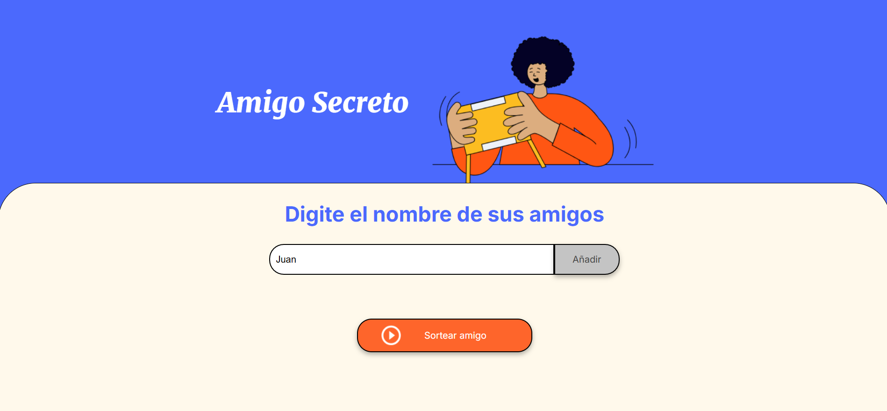
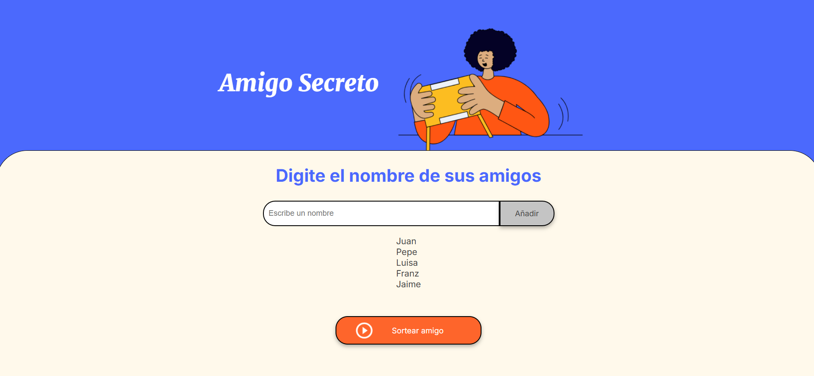
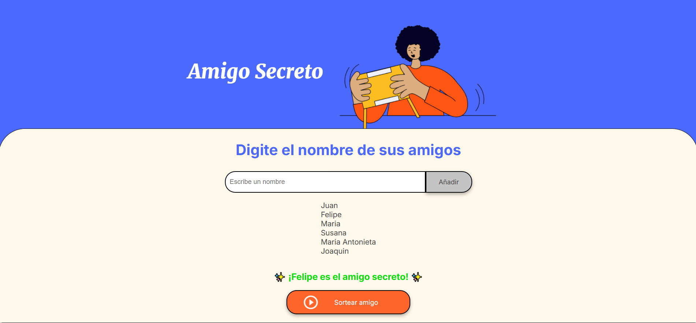

<h1>🎁 Amigo secreto 🎁</h1>

<p align="center">
    
    
</p>

## 📖Tabla de Contenidos📖
1. [Introducción](#📌¿De-que-trata-el-mini-proyecto-"Amigo-Secreto"?)
2. [Características](#📚Caracterísicas-y-funcionamiento)
3. [Acceso al Proyecto](#📁¿Cómo-acceder-al-proyecto📂)
4. [Tecnologías Utilizadas](#✅Tecnologías-utilizadas)
5. [Cómo Utilizar Amigo Secreto](#🔨¿Cómo-utilizar-amigo-secreto?)
6. [Autor](#💡Autor)

<h2>📌¿De que trata el mini proyecto "Amigo Secreto"?</h2>

Amigo Secreto es una aplicación interactiva muy sencilla que surge como evidencia de una ruta de aprendizaje gracias a los cursos de Lógica de programación de Alura Latam y el programa ONE.

<h2>📚Caracterísicas y funcionamiento</h2>

Amigo Secreto tiene una funcionalidad simple que consta de recibir un nombre que se añade a una lista al pulsar el botón ```Añadir```, mismo que añade el nombre a una lista que se utilizará posteriormente para escoger y mostrar en pantalla un nombre aleatorio de la lista después de pulsar el botón ```Sortear amigo```.

### 📑 ¡Agregue a sus amigos!
* Escribe un nombre en el campo de entrada. Solo se aceptan letras y espacios; no se permiten números ni caracteres especiales.

* Haga clic en el botón <<"Añadir>>.

* El nombre se validará y, si es correcto, se agregará al arreglo de la lista de amigos.

### 👥 ¡Sortee a sus amigos!

* Haga clic en el botón "Sortear amigo". ▶

* Se seleccionará un nombre aleatorio de la lista de amigos.

* El resultado del sorteo se mostrará en pantalla.

### 📝 Validación de nombres
* Al ingresar un nombre, el sistema verifica que solo contenga letras y espacios.

* Si el nombre incluye números o caracteres especiales, mostrará una notificaión y no se añadirá a la lista.

<h2>📁 ¿Cómo acceder al proyecto 📂</h2>

<h3>💻 A traves de Git 💻</h3>

1. Clona el respositorio a través de Git con: 

```
git clone https://github.com/Zhazhi3l/Amigo-Secreto.git
``` 
2. Instala las dependencias:
```
npm install
```
3. Configura las variables de entorno:
```
cp .env.example .env
```

4. Abre el archivo ```index.html``` con el navegador y comienza a utilizarlo. 

<h3>A traves de GitHub Pages </h3> 


 * O bien, puedes acceder desde el siguiente enlace:

 [🌐¡Da clic aquí, Puedes acceder desde el navegador!🌐](https://zhazhi3l.github.io/Amigo-Secreto/) 
 

<h2>✅ Tecnologías utilizadas</h2>

<p align="center">
  
  
  
</p>

<h2>🔨 ¿Cómo utilizar amigo secreto? 🔨</h2>

### Paso 1:
Digite un nombre en el campo de texto, y posteriormente presione el botón <<Añadir>>.
- Igualmente puede ingresar el nombre usando también la tecla ```Enter/Intro```!



### Paso 2:
Una vez añadido, podrá ver reflejado el nombre por debajo del campo de texto. Puede ingresar tantos como desee.



### Paso 3: 
Cuando ya haya agregado toda la lista de amigos que desee puede sortear y se mostrará **¡al amigo secreto!**



<h2>💡 Autor</h2>
 
[¡Puedes visitar mi perfil de LinkedIn!](www.linkedin.com/in/hazzav) <p align="center"></p>
